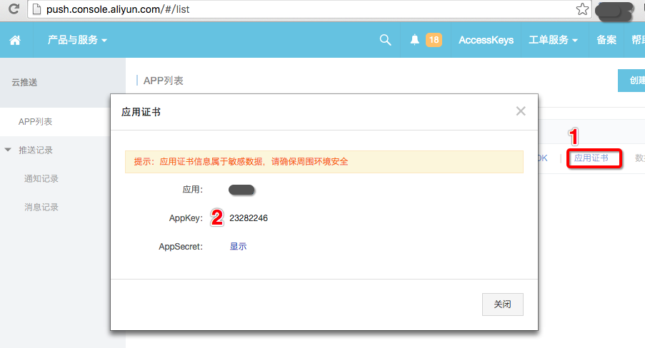

<!-- START doctoc generated TOC please keep comment here to allow auto update -->
<!-- DON'T EDIT THIS SECTION, INSTEAD RE-RUN doctoc TO UPDATE -->


- [Mobile Push OpenAPI Demo](#mobile-push-openapi-demo)
  - [填写配置](#%E5%A1%AB%E5%86%99%E9%85%8D%E7%BD%AE)
  - [示例代码](#%E7%A4%BA%E4%BE%8B%E4%BB%A3%E7%A0%81)
  - [依赖](#%E4%BE%9D%E8%B5%96)
  - [相关资料](#%E7%9B%B8%E5%85%B3%E8%B5%84%E6%96%99)

<!-- END doctoc generated TOC please keep comment here to allow auto update -->

Mobile Push OpenAPI Demo
=========================

填写配置
----------------

拷贝文件[src/test/resources/push.properties.template](src/test/resources/push.properties.template)成`push.properties`，设置上

- `accessKeyId`/`accessKeySecret`： 阿里云账号的`accessKeyId`/`accessKeySecret`   
    获取地址在[Access Key管理页面](https://ak-console.aliyun.com/#/accesskey)。`accessKeyId`/`accessKeySecret`属于阿里云账号，用于所有服务的`OpenAPI`操作。  
    **注意**： `accessKeyId`/`accessKeySecret`可以访问所有服务，注意妥善保管。
- `appKey`： 移动应用的AppKey。  
    在移动推送的控制台 http://push.console.aliyun.com/#/list 的【APP列表】页，点击【应用证书】获取。  
    

下面这些值设置成你的值:

```bash
accessKeyId= _YOUR_ACCESS_KEY_ID_HERE_
accessKeySecret = _YOUR_ACCESS_KEY_SECRET_HERE_

appKey = _YOUR_APP_KEY_HERE_


# 发送的device id列表, 逗号分隔 比如:  111 或是  111,222
deviceIds = _YOUR_DEVICES_ID_LIST_HERE_

# 发送的accounts 列表, 逗号分隔 比如:  account1 或是  account1,account2
accounts = _YOUR_ACCOUNT_LIST_HERE_
```

示例代码
-----------------

- 推送简单的API示例 [PushDemoTest.java](src/test/java/com/aliyun/demo/push/PushDemoTest.java)
    - 推送 通知/消息 给 `Android`
    - 推送 通知/消息 给 `iOS`
- 推送高级API示例 [AdvancedPushDemoTest.java](src/test/java/com/aliyun/demo/push/AdvancedPushDemoTest.java)
- 设备状态查询示例 [DeviceInfoDemoTest.java](src/test/java/com/aliyun/demo/push/DeviceInfoDemoTest.java)

依赖
-----------------

```xml
<dependency>
    <groupId>com.aliyun</groupId>
    <artifactId>aliyun-java-sdk-push</artifactId>
    <version>2.2.4</version>
</dependency>
```

详见 [pom.xml](pom.xml)文件。

相关资料
-----------------

- [移动推送的OpenAPI文档](https://help.aliyun.com/document_detail/30074.html?)
